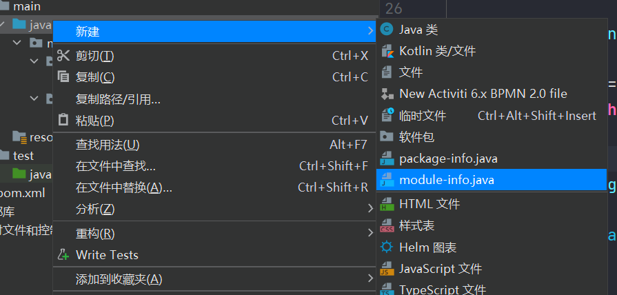
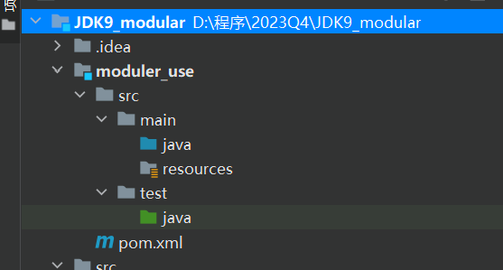
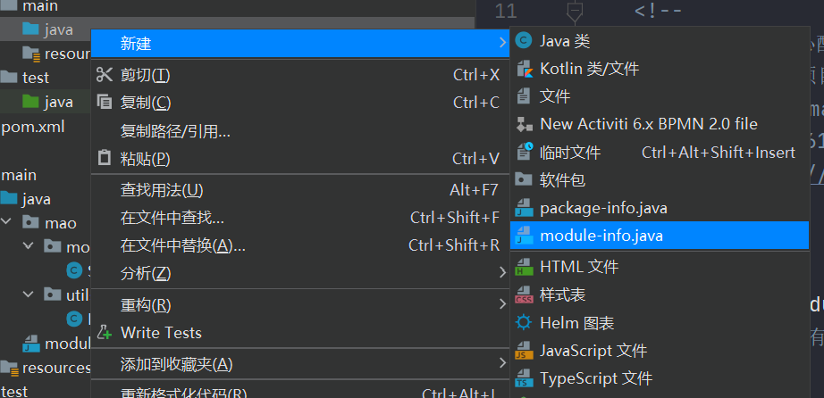
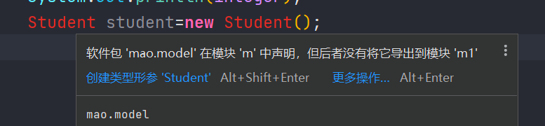
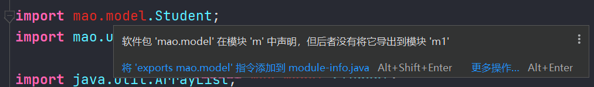
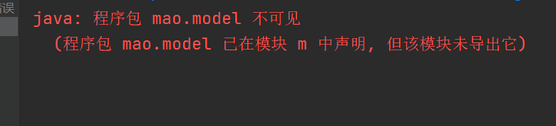

# JDK9

## 模块化系统

### 概述

jdk9之前没有解决的问题：

* **java运行环境代码臃肿、效率低**。Java9之前，每一个runtime自带开箱即用的所有编译好的平台类，这些类被一起打包到一个JRE文件叫做rt.jar。你只需将你的应用的类放到classpath中，这样runtime就可以找到，而其它的平台类它就简单粗暴的从rt.jar文件中去找。尽管你的应用只用到了这个庞大的rt.jar的一部分，这对JVM管理来说不仅增加了非必要类的体积，还增加了性能负载。 Java9模块化可以按需自定义runtime!这也就是jdk9文件夹下没有了jre目录的原因
* **无法隐藏内部API和类型**。很难真正地对代码进行封装,系统对于不同部分的代码无法分离。 在早期我们实现封装都是需要依赖一下权限修饰符, 而权限修饰符只能修饰类、成员变量、成员方法。 权限修饰符我们没法对包进行隐藏，JDK9我们通过隐藏包从而隐藏包中里面的所有类


模块化的目标：

* 减少内存的开销，提高效率
* 强封装： 每一个模块都声明了哪些包是公开的哪些包是内部的，java编译和运行时就可以实施这些规则来确保外部模块无法使用内部类型


### 使用

创建两个包：


在utils新建一个工具类

```java
package mao.utils;

import java.util.Comparator;
import java.util.List;

/**
 * Project name(项目名称)：JDK9_modular
 * Package(包名): mao.utils
 * Class(类名): MaxUtils
 * Author(作者）: mao
 * Author QQ：1296193245
 * GitHub：https://github.com/maomao124/
 * Date(创建日期)： 2023/10/31
 * Time(创建时间)： 9:24
 * Version(版本): 1.0
 * Description(描述)： 无
 */

public class MaxUtils
{
    /**
     * 得到最大值
     *
     * @param list 列表
     * @return {@link Integer} 最大值
     */
    public Integer getMax(List<Integer> list)
    {
        return list.stream().max(Comparator.comparingInt(o -> o)).get();
    }
}
```


在modle包中创建一个Student类

```java
package mao.model;

/**
 * Project name(项目名称)：JDK9_modular
 * Package(包名): mao.model
 * Class(类名): Student
 * Author(作者）: mao
 * Author QQ：1296193245
 * GitHub：https://github.com/maomao124/
 * Date(创建日期)： 2023/10/31
 * Time(创建时间)： 9:31
 * Version(版本): 1.0
 * Description(描述)： 无
 */

public class Student
{
    private Long id;
    private String name;
    private Integer age;

    public Long getId()
    {
        return id;
    }

    public Student setId(Long id)
    {
        this.id = id;
        return this;
    }

    public String getName()
    {
        return name;
    }

    public Student setName(String name)
    {
        this.name = name;
        return this;
    }

    public Integer getAge()
    {
        return age;
    }

    public Student setAge(Integer age)
    {
        this.age = age;
        return this;
    }
}
```


java目录下新建一个输出模块信息，只是输出utils包，model包对外隐藏




```java
module m {
    exports mao.utils;
}
```


创建一个新模块




创建一个M1




```java
module m1 {
    requires m;
}
```


添加依赖

```xml
    <dependencies>

        <dependency>
            <groupId>mao</groupId>
            <artifactId>JDK9_modular</artifactId>
            <version>1.0-SNAPSHOT</version>
            <scope>compile</scope>
        </dependency>

    </dependencies>
```


创建测试

```java
package mao;

import mao.utils.MaxUtils;

import java.util.ArrayList;
import java.util.Collections;
import java.util.List;

/**
 * Project name(项目名称)：JDK9_modular
 * Package(包名): mao
 * Class(类名): Test1
 * Author(作者）: mao
 * Author QQ：1296193245
 * GitHub：https://github.com/maomao124/
 * Date(创建日期)： 2023/10/31
 * Time(创建时间)： 9:43
 * Version(版本): 1.0
 * Description(描述)： 无
 */

public class Test1
{
    public static void main(String[] args)
    {
        List<Integer> list = new ArrayList<>();
        list.add(2);
        list.add(9);
        list.add(4);
        list.add(1);
        Integer integer = new MaxUtils().getMax(list);
        System.out.println(integer);
        //Student student=new Student();
    }
}
```


不能使用Student类










